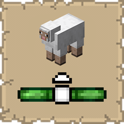

# Mob Locator

## Functionality

* **Real-time Radar:** Displays icons for nearby mobs relative to your current facing direction.
* **Vertical Tracking:** Integrated indicators (arrows) show if a mob is significantly above or below your current Y-level.
* **Hostility Detection:** Uses color coding to distinguish between hostile (Red), passive (White), and neutral entities.
* **Fully Configurable:** Customize colors and toggle visibility for invisible entities via the in-game config menu.
* **Pixel-Perfect Icons:** Custom-rendered geometric icons that blend seamlessly with the vanilla Minecraft UI.

## Benefits
Whether you are caving, hunting specific mobs, or trying to avoid a surprise Creeper, **Mob Locator** provides essential spatial awareness without cluttering your screen with a full mini-map.

* **Lightweight:** Minimal impact on FPS.
* **Vanilla Friendly:** No complex overlays; it looks like it belongs in the base game.
* **Accessibility:** Helps players with hearing difficulties identify which direction mob sounds are coming from.

## Installation

### Prerequisites
* **Minecraft:** 1.21.10
* **Loader:** [Fabric Loader](https://fabricmc.net/use/installer/) (>=0.18.4)
* **Core Dependencies:**
    * [Fabric API](https://modrinth.com/mod/fabric-api)
    * [Cloth Config API](https://modrinth.com/mod/cloth-config) (Required for configuration)
    * [Mod Menu](https://modrinth.com/mod/modmenu) (Recommended for configuration)

### Steps
1.  Download the latest `.jar` from [Modrinth](https://modrinth.com/mod/mob-locator) or [CurseForge](https://www.curseforge.com/minecraft/mc-mods/mob-locator).
2.  Drop the file into your Minecraft `%appdata%/.minecraft/mods` folder.
3.  Launch the game using the Fabric profile.

## Support
If you encounter bugs or wish to contribute:
* [Report any problems you find.](https://github.com/armaninyow/Mob-Locator/issues)
* [Submit your improvements and code changes.](https://github.com/armaninyow/Mob-Locator/pulls)

## Credits
* **Author**: Armaninyow
* **License**: Released under [CC0-1.0](https://creativecommons.org/publicdomain/zero/1.0/).

