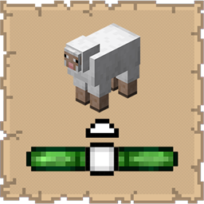

# Mob Locator

## Installation

* [Modrinth](https://modrinth.com/mod/mob-locator)
* [CurseForge](https://www.curseforge.com/minecraft/mc-mods/mob-locator)

## Support
   
If you encounter bugs or wish to contribute:
* [Report any problems you find.](https://github.com/armaninyow/Mob-Locator/discussions/categories/issues)
* [Share your ideas for new features.](https://github.com/armaninyow/Mob-Locator/discussions/categories/suggestions)

## Changelog

  

   
### 4.2.0—26.x
* Added support for Minecraft 26.2
* Added Per-Mob Colors support for Sulfur Cube
### 4.1.0—26.x
* Added a "Use Per-Mob Colors" option that gives each mob its own unique color based on its real in-game appearance, instead of one shared color for all hostile or passive mobs
* Updated the Invisible Mob Color setting since invisible mobs can be either hostile or passive and shouldn't share one fixed color, now it only affects the outline color instead of fill color, so invisible mobs stand out without losing their hostile or passive fill color
* Fixed neutral mobs so they now properly turn red when they're actually aggressive, instead of staying their default color or always showing as hostile
### 4.0.0—26.x
* Added support for Minecraft 26.1, 26.1.1, and 26.1.2
* Replaced Cloth Config with YetAnotherConfigLib (YACL) 3.9.3 for the in-game config screen
### 3.1.0—1.21.x
* Merged 1.21–1.21.3 into a single version range to account for API differences from later versions
* Split 1.21.4–1.21.5 into its own version range to account for API differences from 1.21.6 and above
* Fixed a crash on 1.21.2–1.21.3 caused by a rendering API that was not available until 1.21.4
* Fixed a crash on 1.21.5 caused by a rendering API that was not available until 1.21.6
### 3.0.0—1.21.x
* Added multi-version support covering Minecraft 1.21 through 1.21.11
### 2.0.0—1.21.11
* Updated to Minecraft 1.21.11
### 1.2.0—1.21.10
* Added ability to blacklist specific mobs by name to prevent them from appearing on the locator
* Enter mob names in the config menu (e.g., Creeper, Zombie, Iron Golem)
* Blacklisted mobs will not render icons on the locator bar
* Adjusted Arrow Position
* Redesigned Config Menu
### 1.1.0—1.21.10
* Refreshed Mod Icon
* Updated all core build properties to match the 1.21.10 environment: (Fabric Loader: 0.18.4, Yarn Mappings: 1.21.10+build.3, Fabric Loom: 1.14-SNAPSHOT, Cloth Config API: 20.0.149, ModMenu: 16.0.0)
* Performed a global cleanup of the codebase across all Java files to strictly adhere to the official FabricMC formatting and naming conventions
### 1.0.0—1.21.10
* Initial Release

